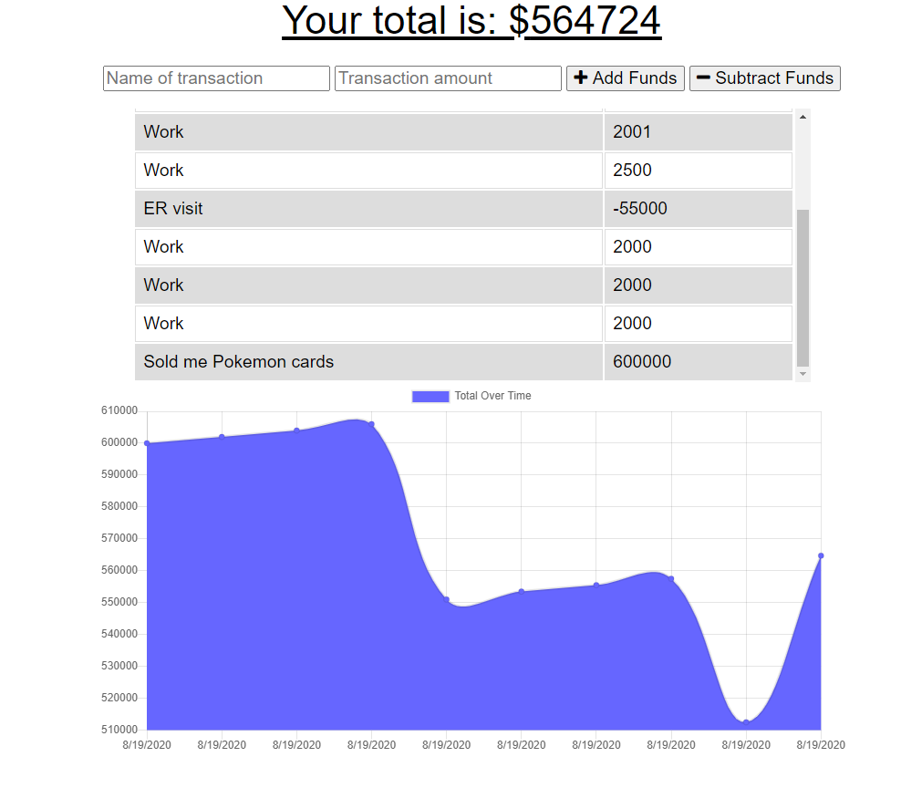

# Progressive Budget Tracker

  
## Testing
  

  
---
  
## Description 
A simple app that lets the user document their budget with a detailed chart. The can be downloaded and stored on a local device so the user can use it any time, even while offline.
                      
--- 
                      
## Table of Contents
                      
                      
* [Installation](#installation)
* [Contributing](#contributing)
* [License](#license)
* [Questions](#questions)
                      
---
                      
## Installation
                      
Simply visit the [Heroku Link](https://cryptic-citadel-66180.herokuapp.com/), and start documenting your expenses and payments. If you would like to use it on a local device, such as your phone, right click or click the top right icon on your screen, and tap "add to homepage."
                                        
---
                      
## Contributing
                      
Mark Mckenna
                      
---
                      
## License
                      
This project is licensed under MIT.
  
Copyright (c) [2020] [Mark McKenna]
  
                      
---
                                                         
## Questions
Have any questions or contributions? Check out my [GitHub Profile](https://github.com/markmckenna37)                 
Or you can email me at <markmckenna37@gmail.com>.
                      
---
                      
## Tests
                      

